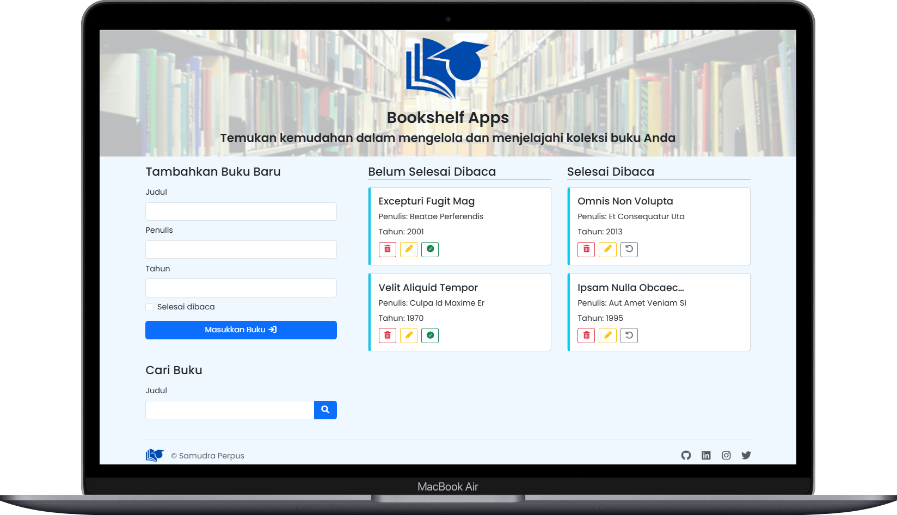

# Bookshelf Apps

Aplikasi **Bookshelf** untuk mencatat, memindahkan, mengedit, menghapus, dan mencari buku. Data **persisten** menggunakan `localStorage`. Dibuat dengan **HTML + CSS (Bootstrap 5)** dan **JavaScript murni** (tanpa framework) sesuai ketentuan submission Dicoding.

---

## Daftar Isi

- [Fitur](#fitur)
- [Preview](#preview)
- [Teknologi](#teknologi)
- [Struktur Proyek](#struktur-proyek)
- [Menjalankan Secara Lokal](#menjalankan-secara-lokal)
- [Cara Pakai](#cara-pakai)
- [Model Data & Penyimpanan](#model-data--penyimpanan)
- [Event Penting](#event-penting)
- [Kepatuhan Kriteria Submission](#kepatuhan-kriteria-submission)
- [Kustomisasi](#kustomisasi)
- [Testing Manual](#testing-manual)
- [Catatan & Masalah Umum](#catatan--masalah-umum)
- [Kredit](#kredit)

---

## Fitur

- ➕ **Tambah buku** melalui formulir.
- 🔁 **Pindah rak** (Belum selesai ⮂ Selesai) dengan satu tombol.
- ✏️ **Edit buku** (judul, penulis, tahun, status).
- ❌ **Hapus buku** dengan dialog konfirmasi.
- 🔎 **Pencarian** buku berdasarkan judul (real-time saat submit).
- 💾 **Persisten**: data tersimpan di `localStorage`.
- 📱 **Responsif** menggunakan Bootstrap 5.
- ✅ **Kepatuhan `data-testid`** sesuai starter project untuk auto-grader.

---

## Preview



---

## Teknologi

- **HTML5** + **CSS3** (Bootstrap 5, custom styling di `assets/css/style.css`)
- **JavaScript** murni (satu berkas: `assets/js/main.js`)
- **SweetAlert2** untuk dialog konfirmasi
- **Web Storage API** (`localStorage`)

---

## Struktur Proyek

```text
.
├─ index.html
├─ assets/
│  ├─ css/
│  │  └─ style.css
│  ├─ img/
│  │  ├─ logo.png
│  │  ├─ slide-1.png
│  │  ├─ slide-2.png
│  │  └─ slide-3.png
│  └─ js/
│     └─ main.js
└─ README.md
```

---

## Menjalankan Secara Lokal

Tidak ada proses build.

1. **Clone/unduh** repositori ini.
2. **Buka** `index.html` langsung di browser, atau jalankan server statis:

   - VSCode: **Go Live** (Live Server).
   - Node.js: `npx serve .` lalu buka alamat yang diberikan.

> Browser modern sudah cukup (Chrome/Edge/Firefox/Safari).

---

## Cara Pakai

1. Isi formulir **“Tambahkan Buku Baru”**:

   - Judul, Penulis, Tahun.
   - Centang **Selesai dibaca** bila sudah selesai.
   - Tombol submit otomatis menampilkan target rak.

2. Buku muncul pada rak:

   - **Belum Selesai Dibaca** atau **Selesai Dibaca**.

3. Aksi pada setiap kartu buku:

   - ✅ / 🔁 **Ubah status** (pindah rak).
   - ✏️ **Edit**: buka modal, simpan perubahan.
   - 🗑️ **Hapus**: konfirmasi, lalu hilang dari UI & `localStorage`.

4. **Cari Buku**: masukkan judul di formulir pencarian dan submit.

---

## Model Data & Penyimpanan

- **Key `localStorage`**: `BOOKSHELF_APPS`
- **Struktur objek buku**:

```json
{
  "id": 1695461234567, // number (timestamp)
  "title": "Judul Buku",
  "author": "Penulis",
  "year": 2024, // number
  "isComplete": false // boolean
}
```

> `id` dihasilkan dari timestamp `+new Date()` agar unik.

---

## Event Penting

- `DOMContentLoaded`: inisialisasi form, sinkronisasi teks tombol submit, memuat data dari storage.
- `onjsonfetched` (custom event): dipicu setelah data diambil dari `localStorage` untuk merender ulang rak.
- Perubahan status/aksi buku akan:

  - memanipulasi DOM,
  - memutakhirkan array `books`,
  - memanggil `updateJson()` untuk menyimpan ke `localStorage`.

---

## Kepatuhan Kriteria Submission

**Wajib**

- [x] **localStorage** dengan struktur objek yang benar.
- [x] **Tambah buku** melalui form dengan **ID unik** (timestamp).
- [x] **Dua rak**: _Belum selesai_ (`#incompleteBookList`) & _Selesai_ (`#completeBookList`).
- [x] **Pindah rak** (ubah `isComplete`) tersimpan ke `localStorage`.
- [x] **Hapus buku** dari UI & `localStorage`.

**Opsional (terpenuhi)**

- [x] **Pencarian** buku berdasarkan judul.
- [x] **Edit** buku melalui modal.
- [x] **Kode rapi** & modular (gabungan aman di `main.js`).
- [x] **Styling** (Bootstrap + custom CSS) tanpa melanggar `data-testid`.

---

## Kustomisasi

- **Styling**: ubah di `assets/css/style.css` atau tambahkan kelas Bootstrap.
- **Jangan ubah** atribut `data-testid` pada elemen:

  - `bookItem`, `bookItemTitle`, `bookItemAuthor`, `bookItemYear`,
  - `bookItemIsCompleteButton`, `bookItemDeleteButton`, `bookItemEditButton`,
  - `searchBookForm*`, `bookForm*`,
  - `incompleteBookList`, `completeBookList`.

- **Teks UI** (mis. judul, label) aman untuk disesuaikan.

---

## Testing Manual

1. **Tambah buku** (kosongkan form → validasi HTML menangani `required`).
2. **Pindah rak** beberapa kali → refresh halaman → status tetap.
3. **Edit buku** (ubah judul/penulis/tahun/status) → simpan → refresh → perubahan bertahan.
4. **Cari judul** yang ada/tidak ada → pastikan filter bekerja.
5. **Hapus buku** → konfirmasi → refresh → item tidak kembali.
6. **Bersihkan data** (jika perlu):

   - DevTools → Application → Local Storage → hapus key `BOOKSHELF_APPS`,
   - atau `localStorage.removeItem('BOOKSHELF_APPS')` di konsol.

---

## Catatan & Masalah Umum

- Jika item **terduplikasi** setelah memuat ulang, pastikan `renderFromBooks()` membersihkan kontainer rak sebelum append (sudah diterapkan).
- Pastikan urutan `<script>` di `index.html`:

  1. Bootstrap Bundle
  2. SweetAlert2
  3. `assets/js/main.js`

- Gambar slider berada di `assets/img/` dan opsional untuk diubah.

---

## Kredit

**Desain & Pengembangan** — Irfan Dwi Samudra

- GitHub: [@irfandwisamudra](https://github.com/irfandwisamudra)
- LinkedIn: [Irfan Dwi Samudra](https://www.linkedin.com/in/irfandwisamudra)
